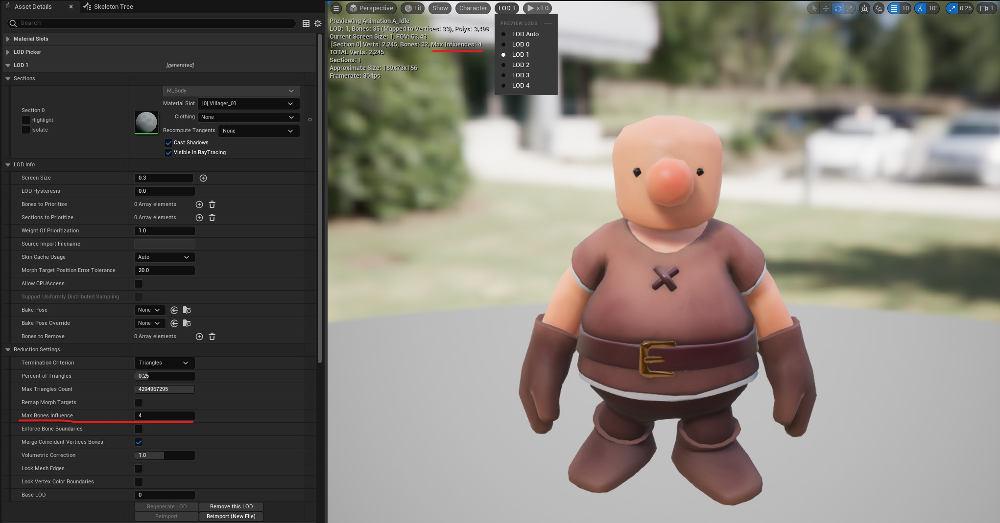
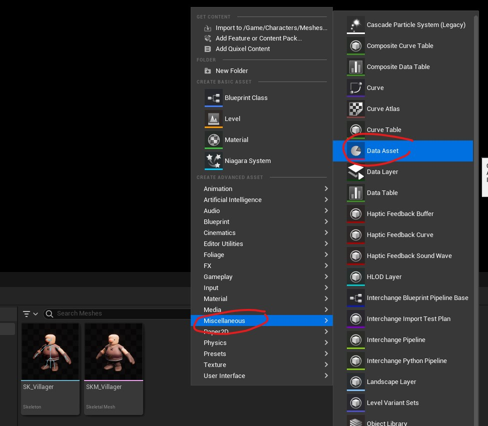
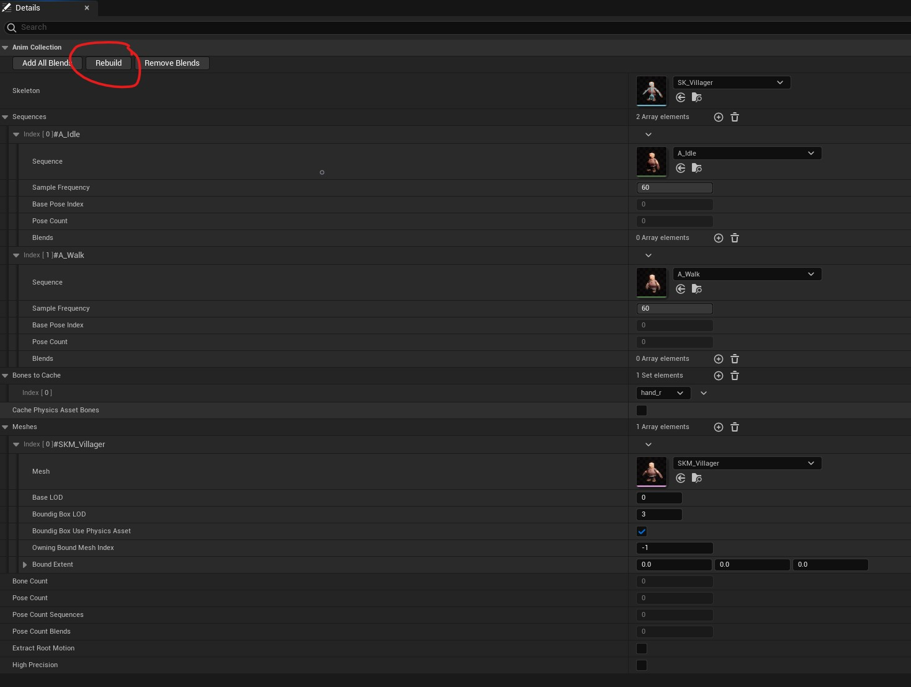
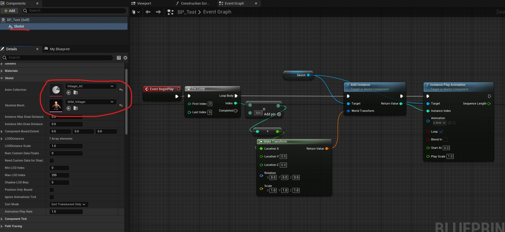
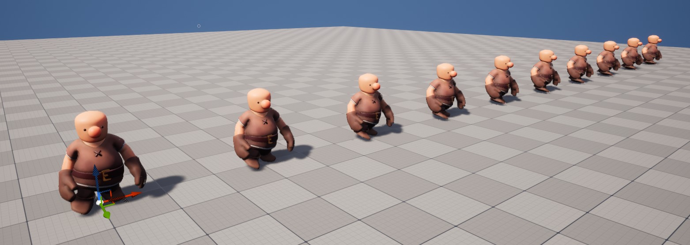

## Skelot Plugin Quick Start

**On this page you will learn how to get started with Skelot Plugin.**

Open your SkeletalMesh and adjust LODs. MaxBoneInfluence supported by Skelot is 4. generally you are supposed to use less MaxBoneInfleunce for higher LODs. Skelot will use proper vertex shader with less instructions;

Right click in Content Browser, click on Miscellaneous/DataAsset and select SkelotAnimCollection.
this is the only DataAsset you deal with. it generates and keeps the required data for rendering, attachments, etc.

Open the asset, add your Skeletal Mesh and Animation Sequences then click Rebuild.

Now its time to use SkelotComponent.
Create a new Blueprint Actor, add a SkelotComponent then set AnimCollection and SkeletalMesh.
Currently SkelotComponent is runtime-only so there is no 'Instances' property like what you see in InstancedStaticMeshComponent. you have to Add/Remove instances by code.(for full details read the comments of USkelotComponent).
here we add several instances and play animation at BeginPlay. 

It's done. just drop the actor into the level and start playing.

### Where do I start as a developer ?

read SkelotComponent.h and SkelotAnimCollection.h